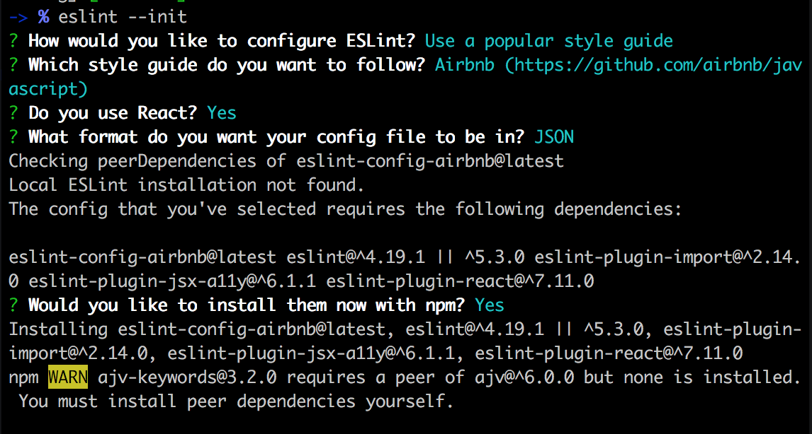

# MY React Blog

### tools
1. npm install react-router react-router-dom
* react-router is used also for mobile, to view different pages, react-router-dom is used for web browser
2. https://magic.reactjs.net/htmltojsx.htm
3. npm install --save indicative //-> for validation package
4. npm i --save axios //-> for api
5. npm i -g eslint //-> tool to help us write better code.
* eslint --init

6. npm i --save prop-types
7. npm i --save-dev babel-eslint
8. cloudinary.com //--> to stored images on the cloud
